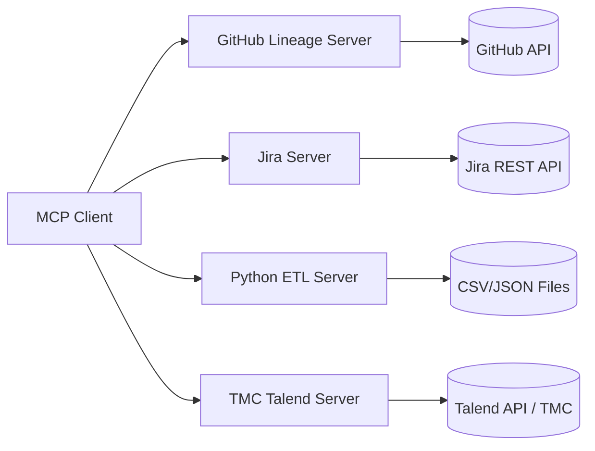

# Architecture

## Overview

This is a multi-server MCP setup where each server focuses on a specific domain and can be run independently.

## Design goals

- Keep each server small and understandable.
- Keep credentials isolated per server (`.env` file per folder).
- Avoid cross-coupling so servers can evolve independently.
- Keep implementation personal-project friendly and vendor-neutral.

## Runtime model

- Transport: Streamable HTTP per server.
- Default ports:
  - GitHub lineage: `8101`
  - Jira: `8102`
  - Python ETL: `8103`
  - TMC Talend: `8104`

## Security notes

- Never commit real tokens to source control.
- Use environment variables from each folder's `.env` file.
- Keep API scopes minimal for each integration.
