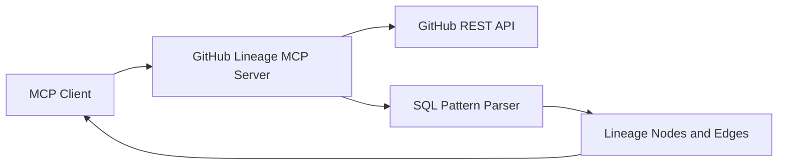

# GitHub Lineage Architecture

## Notes

- The lineage logic is intentionally simple and regex-based.
- Works best with SQL files that use clear `FROM`, `JOIN`, `INTO`, and `UPDATE` clauses.
- Designed to be extended later with parser-level lineage accuracy.
