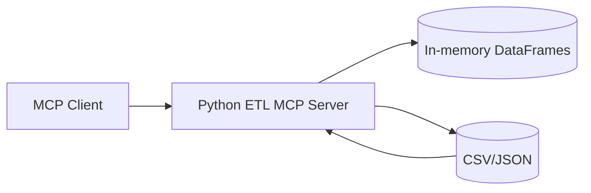

# Python ETL Architecture

```mermaid
flowchart LR
    Client[MCP Client] --> Server[Python ETL MCP Server]
    Server --> Memory[(In-memory DataFrames)]
    Files[(CSV/JSON)] --> Server
    Server --> Files
```

## Notes

- Datasets are process-local and reset when server restarts.
- Best for lightweight transformations and personal workflows.
