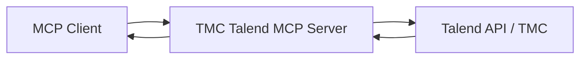

# TMC Talend Architecture

```mermaid
flowchart LR
    Client[MCP Client] --> Server[TMC Talend MCP Server]
    Server --> API[Talend API / TMC]
    API --> Server
    Server --> Client
```

## Notes

- Uses bearer token authentication.
- Focuses on workspace/task/execution visibility.
- Can be extended with create/update operations later.
